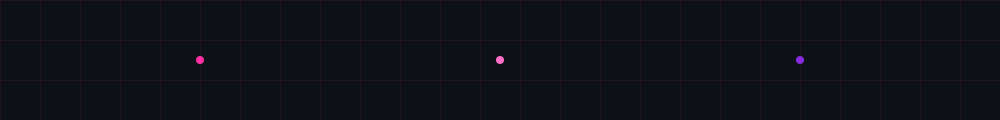

ASP.NET Developer • .NET Backend Builder • Computer Science Student

---

###  Tech Stack

---

###  GitHub Stats

---

###  Featured Projects

**Campus Recruitment Platform**  
A platform connecting startups with students for early internships.

**Global Health Data Analysis**  
Analyzed vaccination and disease datasets with ML insights.

**Leave Management System**  
Full-stack ASP.NET web app with employee/admin dashboards.

**QR Code Generator**  
Customizable QR generator with colors, logos, and downloads.

---

###  Currently Learning

• Advanced ASP.NET architecture  
• Backend system design  
• Building real startup products  

---

###  Connect

LinkedIn  
https://linkedin.com/in/viva-baranwal  

GitHub  
https://github.com/vivabaranwal 

